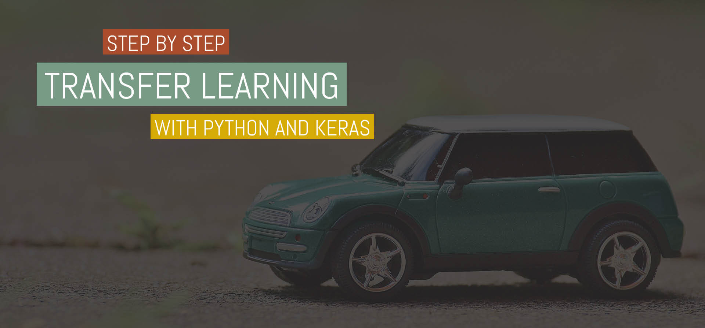

# Transfer Learning


[Data Science Meetup Münster #9](https://www.meetup.com/de-DE/Data-Science-Meetup-Muenster/events/247182267/ "Data Science Meetup Münster #9")

## Install Requirements
The easiest way to install all required packages is to use [Anaconda](https://www.anaconda.com/download/ "Anaconda")
and create an isolated environment.
```
conda create --name meetup
source activate meetup
conda install --file requirements.txt --yes
```

## Launch Notebook
```
jupyter notebook meetup.ipynb
```

## Get Data
There is no image data provided with this repository, so you will have to download
images yourself. You can search for `google image downloader` on github to find scripts
that automatically download images from google.
Save the images in separate folders, based on their labels.
```
|-- meetup
    |-- images
      |-- left
      |-- right
      |-- front
      |-- rear
    meetup.ipynb
```
